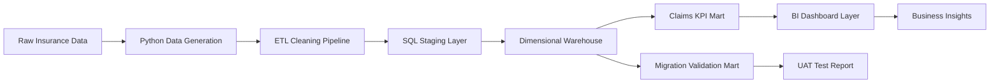

# Insurance Claims BI Migration & Performance Analytics Platform

## Project Overview

This project simulates a real Business Analyst Data / Business Intelligence assignment inside an insurance company. The objective is to migrate legacy QlikView-style insurance claims reporting into a modern Qlik Sense-style BI environment while maintaining KPI accuracy, improving dashboard performance, validating business logic, and supporting users during the transition.

The project is designed around the type of work expected in a **Business Analyst Data / BI internship in insurance IARD / P&C**, especially for automobile claims, settlements, recours, and operational reporting.

Instead of building a generic dashboard project, this repository follows a realistic enterprise workflow:

1. Generate and prepare large insurance datasets
2. Clean, validate, and structure data
3. Build SQL staging and warehouse layers
4. Create insurance claims KPIs
5. Simulate QlikView to Qlik Sense migration validation
6. Test migrated dashboards through UAT scenarios
7. Document insights, recommendations, and user guidance

---

## Business Context

An insurance company uses legacy BI applications to monitor automobile claims performance. Business teams rely on these dashboards to track claim volumes, settlement costs, recovery amounts, fraud indicators, processing delays, and SLA breaches.

The company wants to migrate reporting from an older QlikView-style environment to a modern Qlik Sense-style BI layer. The challenge is not only technical. The migrated dashboards must keep the same business meaning, produce accurate KPIs, run faster, and remain easy for business users to understand.

This project answers one central question:

> How can we migrate insurance claims reporting while preserving KPI accuracy, improving performance, and giving business users reliable dashboards for decision-making?

---

## Job Description Alignment

| JD Requirement | How this project covers it |
|---|---|
| QlikView to Qlik Sense migration | Simulated BI migration plan, KPI parity checks, validation framework |
| Data cleaning and structuring | Python ETL pipeline and SQL staging tables |
| KPI dashboards | Claims, settlements, recours, fraud, and SLA dashboard specification |
| Performance optimization | SQL optimization logic, aggregated marts, dashboard load-time analysis |
| Testing and validation | UAT test book with scenarios, expected results, and acceptance criteria |
| Business Intelligence | Star schema, KPI layer, dashboard wireframe, executive insights |
| Insurance domain | Automobile claims, policy contracts, settlement delays, recours recovery |
| Documentation | Data dictionary, migration plan, UAT test book, user guide |
| User training | Dashboard user guide written for non-technical insurance users |

---

## Dataset Strategy

Real insurance claims data usually contains sensitive customer, policy, and claim information. For that reason, this project uses a realistic synthetic data generation approach inspired by public insurance reporting structures.

The generated dataset simulates:

- Customers
- Insurance policies
- Automobile claims
- Claim payments
- Recours / recovery records
- Dashboard usage logs
- Legacy vs migrated KPI outputs

Expected generated scale:

| Dataset | Approximate rows |
|---|---:|
| Customers | 50,000 |
| Policies | 60,000 |
| Claims | 120,000 |
| Payments | 140,000 |
| Recours records | 25,000 |
| Dashboard usage logs | 30,000 |

---

## Project Architecture



---

## Repository Structure

```text
insurance-claims-bi-migration/
├── README.md
├── requirements.txt
├── src/
│   ├── generate_large_insurance_dataset.py
│   ├── etl_cleaning_pipeline.py
│   └── claim_risk_model.py
├── sql/
│   ├── 01_schema.sql
│   ├── 02_transform_to_warehouse.sql
│   └── 03_business_analysis_queries.sql
├── docs/
│   ├── data_dictionary.md
│   ├── migration_plan.md
│   ├── uat_test_book.md
│   └── dashboard_user_guide.md
└── dashboards/
    └── dashboard_specification.md
```

---

## Main Business Questions

### Claims Performance

- Which regions have the highest number of claims?
- Which claim types generate the largest settlement cost?
- Which claim categories take the longest to settle?

### Operational Efficiency

- What is the average claim settlement time?
- Which claims breach the target SLA?
- Which regions or claim types create bottlenecks?

### Recours / Recovery

- How much money is recovered from third parties?
- Which claim types have the strongest recovery potential?
- What is the recovery rate by region?

### Fraud and Risk Monitoring

- Which claims show suspicious patterns?
- Which customers have repeated claims in a short period?
- Which claim types carry higher fraud risk?

### BI Migration Validation

- Do migrated KPIs match legacy dashboard KPIs?
- Which KPIs fail parity checks?
- Which dashboards have slower load times after migration?

---

## Core KPIs

| KPI | Meaning |
|---|---|
| Total Claims | Total number of claims registered |
| Total Claimed Amount | Total estimated financial exposure |
| Total Settled Amount | Amount actually paid after claim review |
| Average Settlement Days | Average time between claim date and settlement date |
| SLA Breach Rate | Percentage of claims settled after target SLA |
| Fraud Suspected Rate | Percentage of claims marked with fraud risk |
| Recours Recovery Rate | Recovery amount compared to settlement amount |
| Open Claims | Claims still under processing |
| Rejected Claims | Claims rejected after review |
| Dashboard Load Time | BI performance metric after migration |
| KPI Parity Rate | Match rate between old and migrated dashboard values |

---

## Example SQL Questions Covered

### 1. Claims by region

```sql
SELECT
    region,
    COUNT(*) AS total_claims,
    SUM(claim_amount) AS total_claim_amount
FROM fact_claims
GROUP BY region
ORDER BY total_claim_amount DESC;
```

### 2. Average settlement time

```sql
SELECT
    claim_type,
    AVG(DATEDIFF(DAY, claim_date, settlement_date)) AS avg_settlement_days
FROM fact_claims
WHERE settlement_date IS NOT NULL
GROUP BY claim_type
ORDER BY avg_settlement_days DESC;
```

### 3. SLA breach rate

```sql
SELECT
    claim_type,
    COUNT(*) AS total_claims,
    SUM(CASE WHEN settlement_days > 30 THEN 1 ELSE 0 END) AS sla_breaches,
    ROUND(100.0 * SUM(CASE WHEN settlement_days > 30 THEN 1 ELSE 0 END) / COUNT(*), 2) AS sla_breach_rate
FROM fact_claims
GROUP BY claim_type
ORDER BY sla_breach_rate DESC;
```

### 4. KPI migration parity check

```sql
SELECT
    old.kpi_name,
    old.kpi_value AS qlikview_value,
    new.kpi_value AS qliksense_value,
    ABS(old.kpi_value - new.kpi_value) AS difference,
    CASE
        WHEN ABS(old.kpi_value - new.kpi_value) <= 0.01 THEN 'PASS'
        ELSE 'FAIL'
    END AS validation_status
FROM legacy_kpi_outputs old
JOIN migrated_kpi_outputs new
    ON old.kpi_name = new.kpi_name;
```

---

## Dashboard Pages

### 1. Executive Claims Overview

Shows claim volume, total financial exposure, settlement amount, fraud rate, and SLA breach rate.

### 2. Claims Operations Dashboard

Focuses on claim processing delays, settlement time, open claims, overdue claims, and regional bottlenecks.

### 3. Recours and Recovery Dashboard

Tracks recovery potential, recovery amount, unresolved recours, and recovery rate by claim type.

### 4. Migration Validation Dashboard

Compares old and new KPI values, highlights failed validation checks, and tracks dashboard load-time improvement.

---

## Example Business Insights

### Insight 1: Claims delay concentration

High-severity automobile collision claims create the strongest operational pressure because they combine high settlement value with longer processing delays. These should be monitored separately in the migrated dashboard.

### Insight 2: Recours recovery opportunity

Claims involving third-party liability show higher recovery potential. A dedicated recovery dashboard can help claims teams prioritize cases where financial recovery is most likely.

### Insight 3: BI migration risk

Even small KPI definition differences can create reporting mistrust. KPI parity testing should be completed before production deployment, especially for settlement amount, open claims, and SLA breach rate.

### Insight 4: Dashboard performance

Large transactional tables should not be queried directly by business dashboards. Aggregated KPI marts improve dashboard load time and reduce repeated calculation overhead.

---

## Tools and Technologies

| Area | Tools |
|---|---|
| Data generation | Python, Faker, NumPy, pandas |
| Data cleaning | Python, pandas |
| Database | SQL Server style scripts |
| BI modeling | Star schema, facts and dimensions |
| Dashboard design | Qlik Sense-style dashboard specification, transferable to Power BI |
| Testing | UAT test book, KPI parity validation |
| Documentation | Markdown business documentation |

---

## How to Run

Install dependencies:

```bash
pip install -r requirements.txt
```

Generate datasets:

```bash
python src/generate_large_insurance_dataset.py
```

Run cleaning pipeline:

```bash
python src/etl_cleaning_pipeline.py
```

Run simple risk scoring model:

```bash
python src/claim_risk_model.py
```

Then load the output CSV files into SQL Server and execute scripts from the `sql/` folder.

---

## Interview Explanation

A strong way to explain this project:

> I built an insurance claims BI migration simulation based on a QlikView to Qlik Sense reporting migration. I generated a large insurance claims dataset, cleaned and structured the data, designed SQL staging and warehouse layers, created business KPIs for claims and recovery monitoring, and documented UAT scenarios to validate migrated dashboards. The project helped me practice the full workflow of a BI/Data Business Analyst: data preparation, KPI definition, performance optimization, testing, documentation, and business user support.

---

## Why this project is useful

Most student BI projects stop at charts. This project goes further by showing the real enterprise work behind dashboards:

- data preparation
- migration logic
- KPI accuracy
- testing
- user documentation
- performance thinking
- insurance business context

That is the actual work companies need from a Business Analyst Data / BI profile.
